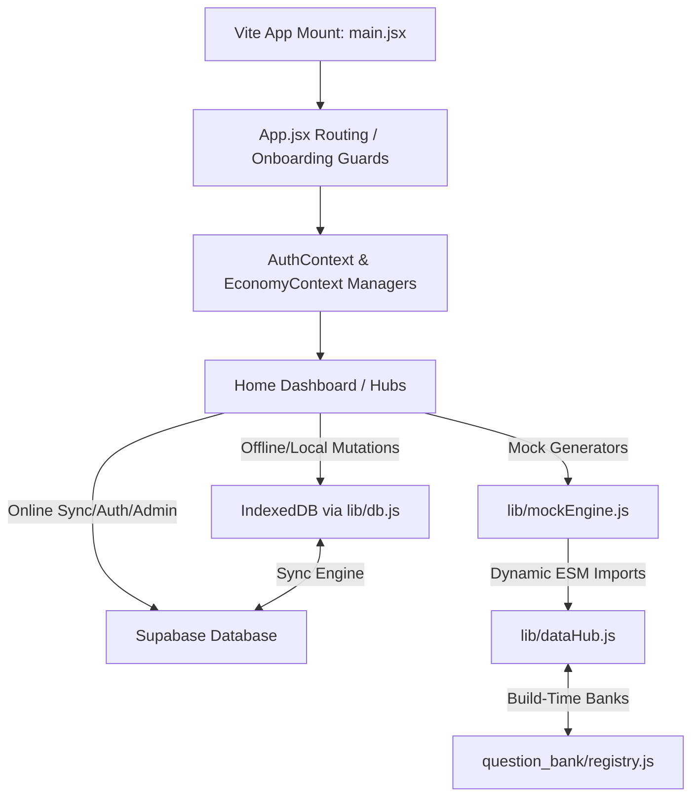

# MCQ Review & Practice Dashboard - Technical Architecture Audit & Codebase Map

This document is designed for future AI developers and senior coders. It provides a deep-dive technical audit of all systems, dependencies, hooks, contexts, file locations, state machines, and local-to-cloud synchronization pathways.

---

## 1. High-Level Architecture Overview

The application is built as a single-page React app using **Vite**, **Vanish-CSS** styling, and **IndexedDB** for local-first operations, with **Supabase** acting as the cloud data backend.



---

## 2. Comprehensive Directory & File Analysis

### `/src/context` (State Managers)
1. **`AuthContext.jsx`**:
   - Manages state for the authenticated Supabase user profile.
   - Listens to Supabase auth events (`onAuthStateChange`).
   - Interlinks: Calls `initDB()` from `lib/db.js` on successful logins to trigger local-to-cloud profile synchronization.
2. **`EconomyContext.jsx`**:
   - Extends the core user object with gamified properties: `kash_coins_balance`, `current_streak_days`, `user_tier`, and `target_exam`.
   - Methods:
     - `loadEconomy()`: Loads user stats from IndexedDB's `user_economy` store. If online, merges it with Supabase profiles table, prioritizing higher coin balances and preserving streaks.
     - `transactKC(amount, reason)`: Modifies coins locally and writes transaction history records into the database. Handles negative transacts for mock purchases.
     - `toggleProTier()`: Mutates state from `FREE` to `Pro`. Mutates local IndexedDB and runs Supabase update.

### `/src/lib` (Engines & Services)
1. **`db.js`** (Offline Engine):
   - Initializes IndexedDB (`MCQKashDB`) under version `7`.
   - **Required Object Stores**:
     - `mock_stats`: Solved mock metadata (scores, timestamps).
     - `bookmarks`: Bookmarked questions. Keyed by question `id`.
     - `user_economy`: User currency, badges, and target exam options.
     - `revision_questions`: SRS/mistake pool. Contains Spaced-Repetition statistics (`interval`, `repetitions`, `easiness`, `next_review_date`).
     - `offline_questions`: Backup cache for question bank synchronization.
   - **Spaced-Repetition System (SRS)**:
     - Utilizes `SRS_INTERVALS = [1, 3, 7, 15, 30, 60]` to schedule reviewed mistakes based on correctness.
2. **`mockEngine.js`** (Deterministic Generator):
   - **Mulberry32 PRNG**: Generates deterministic sequences from seeds mapping to unique string hashes (e.g. `examIdToSeed(examId)`).
   - **Unified Tag-wise Clustering**: Evaluates the category pool, groups questions by tags ($\ge 3$ questions), pads to exactly 10 questions using remaining items, and names them `[Tag Name] Mock [Index]`. Pushes all to the `All` tab and registers topic-specific indices in `mocksByTopic`.
   - **Exam-Specific Sprints**: Extracts clean exam names (strips 4-digit years), groups them by exam, clusters them into sprints of 10, and prioritizes the user's `target_exam` to the front of the list.
3. **`dataHub.js`** (Dynamic Loader):
   - Exposes `ensureCategoryLoaded(categoryId)` which uses standard ESM dynamic imports mapped to `/src/question_bank/registry.js` loaders. Ensures category banks are loaded on-demand without slowing page rendering.

### `/src/components` (Core UI Blocks)
1. **`ExamEngine.jsx`** (State Machine):
   - Renders mock questions and monitors timer countdowns.
   - **FOMO Gating Logic**: If the user is on the `FREE` tier, it intercepts questions during `useEffect` (excluding resurrection/SRS modes) and randomly locks between 10% and 20% of questions, injecting a locked placeholder dummy card.
   - **50-50 Lifelines**: Tracks lifeline utility and deducts coins via `transactKC` upon use.
2. **`ResultDashboard.jsx`**:
   - Evaluates answers, calculates accuracy, and updates the local IndexedDB stats database.
   - Automatically computes Spaced Repetition Promotions: marks corrected mistakes, schedules next review intervals, and adds streaks. Handles coin transactions (e.g. awarding coins for scoring $\ge 80\%$).

### `/src/pages` (Routing & Views)
1. **`AdminSubiStudio.jsx`** (Hardened Admin panel):
   - Super-admin review center. Performs bulk uploads, deletes, and edits.
   - **AI Bulk Rewriter**: Renders contenteditable HTML blocks containing metadata headers (`data-db-id` and `data-status`).
   - Uses Supabase `.upsert(payload, { onConflict: 'id' })` to safely bulk update questions without duplication.
   - **Sanitizers**: Intercepts pasting events to clean HTML tags and strips database IDs on new entries to prevent ID collision.
2. **`SubjectMockDashboard.jsx`**:
   - Retrieves `economy?.target_exam` and generates active clustered mocks.
   - Filters out empty/dead tags from the dropdown filter menu (topics where neither mini mocks nor elite mocks were generated).
3. **`BattleArena.jsx`** (Opponent Matchmaking & Competition Arena):
   - Wagers 100 KashCoins per search entry, charging/rewarding coin balances via `transactKC`.
   - **Opponent Matchmaking Engine**: Fetches exactly 1 candidate opponent utilizing the `get_diverse_opponent` database RPC. To guarantee uniqueness and zero repetition of recent opponents, it tracks the user's last 6 matched opponent usernames in `localStorage` and passes them as an exclusion array to Supabase.
   - **Anti-collision Check**: Filters out profiles where username matches referrer, or referred_by matches the user's username in SQL.
   - **Real Competition Feel**: Employs an offline generator fallback with a collection of static opponents if no active profiles match or connection is offline.

---

## 6. Critical Linkages & Data Mapping

```
[Exam Completed]
      │
      ▼
[ResultDashboard.jsx] ───► Updates IndexedDB: user_economy (adds coins)
      │               ───► Updates IndexedDB: mock_stats (records solved)
      ▼
[Sync Engine (lib/db.js)]
      │
      ▼
[Supabase Profiles / Attempts Tables] (Saves progress to the cloud)
```

1. **Question Status Mapping**:
   - `published`: Visible to all users in practice/exam portals.
   - `unpublished`: Visible only in the Admin review panel (visually labeled as **Private** in dropdowns, but stored as `"unpublished"` in database columns).
2. **Target Exam Integration**:
   - Selected in `StudyGoalsModal.jsx`, saved in `EconomyContext`, and stored in the `profiles` table.
   - Directly dictates the layout sorting order on the Home Page and MCQ practice engines.
